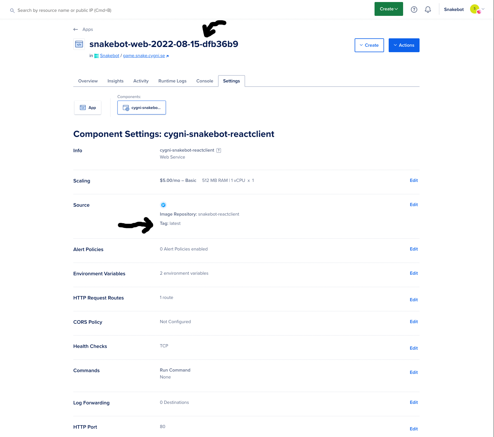

# Snakebot Reactclient

This is the webclient for the Cygni snakebot tournament written in React with TypeScript. This application communicates with a [snakebot game server](https://github.com/cygni/snakebot) using a websocket.

#

## Users

If you are a user who **only** wants to code your own bot, then simply head to the [snakebot client respository](https://github.com/cygni/snakebot-client-js) and follow the instructions there. There will be a _docker-compose_ file there to easily get your own server and webclient running as containers without the need to clone them from here.

#

## Maintainers

### Requirements

- Node.js >= 16.15.1
- npm >= 8.11.0

#

### To get the development server running locally

After cloning the repository, open a terminal inside the root folder and run the following commands:

```
> npm install
> npm start
```

The server should now be running on http://localhost:8090.

#

### **Contact information for DockerHub and DigitalOcean access**

emil.breding@cygni.se

a.johansson@cygni.se

#

### **Updates and Docker**

**IMPORTANT**: Commits on the **main** branch will launch an action that builds and **overrides** the docker image tagged as the latest on [DockerHub](https://hub.docker.com/r/cygni/snakebot-reactclient/tags). Therefore it is important to **ONLY** push changes to **main** that works and have been tested, to ensure that latest image works for anyone who wants to use it. If a commit is deemed **stable** you can also add a **tag** to that commit to ensure it remains on [DockerHub](https://hub.docker.com/r/cygni/snakebot-reactclient/tags) without getting overwritten. E.g creating a release with a tag will both push the newly build docker image with the tag latest **AND** the tag name given as long as it follows the standard **X.X.X** name.

Because of what mentioned above, when adding a new feature or changing some behavior, make sure to work on a **different branch** first before pushing to **main**.

### **Production**

**IMPORTANT**: Commits to the main branch will also act as commits towards production. Rebuilding the images on DockerHub through commits from main will cause the production server to reboot with the updated version of the image.

#

### **Hosting and Version tracking**

This system is hosted on the **_digitalocean_** platform. As mentioned above, commits to the main branch will automatically cause a forced rebuild and deployment of the updated image that is created. What version of the system that is currently running can be identified by a date and hashcode for that release. This can be seen in the app's name in the digitalocean repository. The hashcode is retrieved from the latest commit, allowing us to overview what version and changes that are made on the current version.

To change the version/tag of the docker image that is run on production, we have to modify this manually. Head over to the [digitalocean app](https://cloud.digitalocean.com/apps/1133b332-913d-437a-892c-27f4692e95ba/overview) and navigate to the webclient component via the link on the overview page. Press the edit button for the "Source setting". New releases will automatically have the tag 'latest'. If you've added a custom tag for a commit and want to run this version on production, simply change the input in this field to the corresponding tag name.


